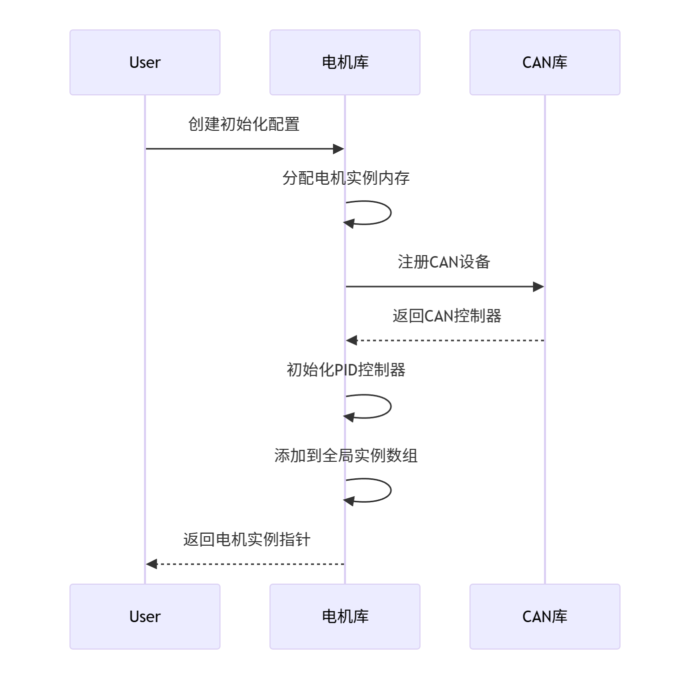
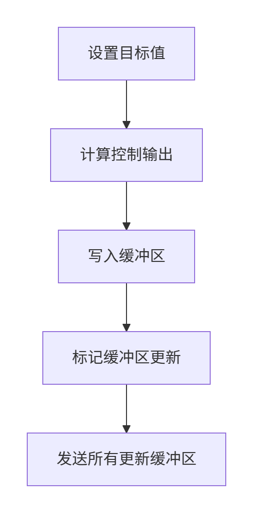

电机控制说明：
1.每一个电机使用一个结构体涵括，结构体如下：
（目的：该结构体描绘了DJI电机的一切信息，包含了电机的控制状态以及控制参数）
/**DJI电机实例**/
```c++
#pragma pack(1)
typedef struct
{
    char motor_name[16];                //电机名
    Djimotor_type_e motor_type;         //电机类型
    Djimotor_status_e motor_status;     //电机运动状态
    Djimotor_measure_t motor_measure;   //电机自身运动信息
    Djimotor_controller_t   motor_pid;  //电机自身的PID控制器
    Can_controller_t can_controller;    //电机自身的CAN管理者
}Djimotor_device_t;
#pragma pack()
```
解释：
1.【motor_name】其中每一个电机有一个名字motor_name（可选），这个可有可无，目的是明确该电机属于哪一个部分，但似乎可以通过变量名来表示。
2.【motor_type】电机类型，需要选择该电机是大疆电机的哪一个款式，因为G3508,M2006,GM6020电机它们的CAN发送ID是不一样的，接收ID也是不一样的，本意是根据不同电机类型，需要进行不同的处理。
3.【motor_status】电机运动状态，里面只有ENABLED和STOPPED,目的是如果手动输入电机状态或者用一个函数来实现，就可以控制电机它能否运动。
4.【motor_measure】电机自身运动信息，存储电机CAN回传的数据，解析出来的电机自身转速，编码器值等数据
5.【motor_pid】电机自身的PID控制器，该结构体包含了电机的控制模式，电机的PID控制器一切参数
6.【can_controller】电机自身的CAN管理者，这个非常重要，包含了电机CAN的发送/接收ID，接收缓冲区，在调用电机控制函数的时候，需要用到里面的信息，然后通过CAN发送出去
    - 接收缓冲区需要自己写好准备

电机接口使用说明：
## 控制部分接口
1.初始化流程


``````c++
代码：
    Djimotor_init_config_t motor_config = {
    .motor_name = "LF Wheel",
    .motor_type = M3508,
    .motor_status = MOTOR_ENABLED,
    .motor_controller_init = {
        .close_loop = ANGLE_AND_SPEED_LOOP,
        .current_pid = {.kp = 0.5f, .ki = 0.01f, ...},
        .angle_pid = {.kp = 5.0f, .ki = 0.1f, ...},
        .speed_pid = {.kp = 0.8f, .ki = 0.05f, ...}
    },
    .can_init = {
    .can_handle = &hcan1,
    .can_id = 0X200,       // 电机ID (1-8)
    .tx_id = 0x200,   // 发送ID
    .rx_id = 0x201    // 接收ID
    }
    };
    Djimotor_device_t *lf_motor = DJI_Motor_Init(&motor_config);
``````
2.控制流程

代码：
```c++
 // 设置目标角度(90度)
    Djimotor_set_target(lf_motor, M_PI / 2);
```
   
## 状态设置/获取：
代码：
```c++
 // 停止电机
    Djimotor_set_status(lf_motor, MOTOR_STOP);
    // 获取电机状态
    if (Djimotor_get_status(lf_motor) == MOTOR_ENABLED) {
    // 获取测量数据
    Djimotor_measure_t measure = Djimotor_get_measure(lf_motor);
    printf("Angle: %.2f rad, Speed: %.2f RPM\n",
    measure.current_angle, measure.angular_velocity);
    }
```

## 电机PID参数切换
代码：
```c++
    Djimotor_controller_init_t new_controller={
        .close_loop = SPEED_LOOP,
        .speed_pid = {.kp = 0.8f, .ki = 0.05f, ...}
    }
    Djimotor_change_controller(lf_motor,new_controller);

```

   