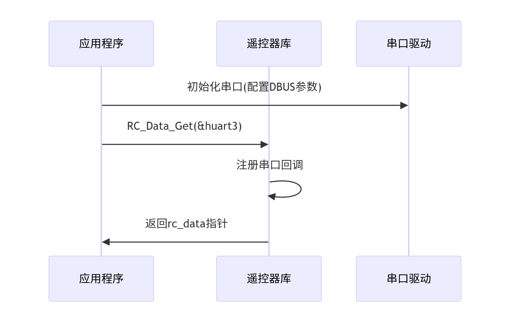

接口使用说明：
使用流程：


## 摇杆方向定义：
>往上打为正，往下打为负
>往右打为正，往左打为负

## 拨盘方向定义
>往上打为正，往下打为负


代码例程：
1.在Freertos创建的任务.c文件中包含头文件
```c++
    #include "remote_control.h"
```
2.定义遥控器实例，在所有文件中仅可定义一次，必须采用static（该实例在Robot_task文件中定义）
```c++
    RC_ctrl_t *rc_data;
```
3.调用遥控器库的API，初始化遥控器实例
```c++
    rc_data = RC_Data_Get(&huart3);
```
4.以上步骤完成后，便可自由的使用遥控器的数据作为机器人的控制量
```c++
        // 左侧开关状态为[下]纯遥控器拨杆控制
     if (switch_is_down(rc_data[CURRENT].rc.Lswitch) )
    { // 按照摇杆的输出大小进行角度增量,增益系数需调整
        gimbal_cmd_send.yaw += 0.0018f * (float)rc_data[CURRENT].rc.Lrocket_x;//原始是0.005
        gimbal_cmd_send.pitch += 0.002f * (float)(rc_data[CURRENT].rc.Lrocket_y);//初始的时候是没有负号的
           // 云台软件限位
        if(gimbal_cmd_send.pitch>=30)
        {
            gimbal_cmd_send.pitch=30;
        }
        else if (gimbal_cmd_send.pitch <=-60)
        {
            gimbal_cmd_send.pitch=-60;
        }
        
    }
```